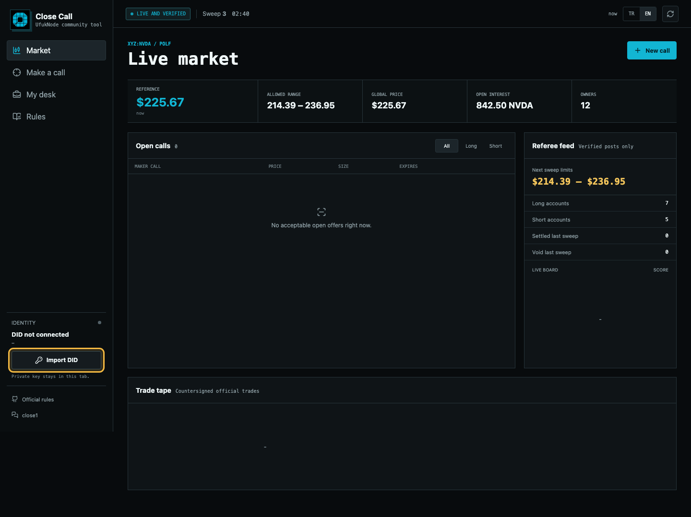
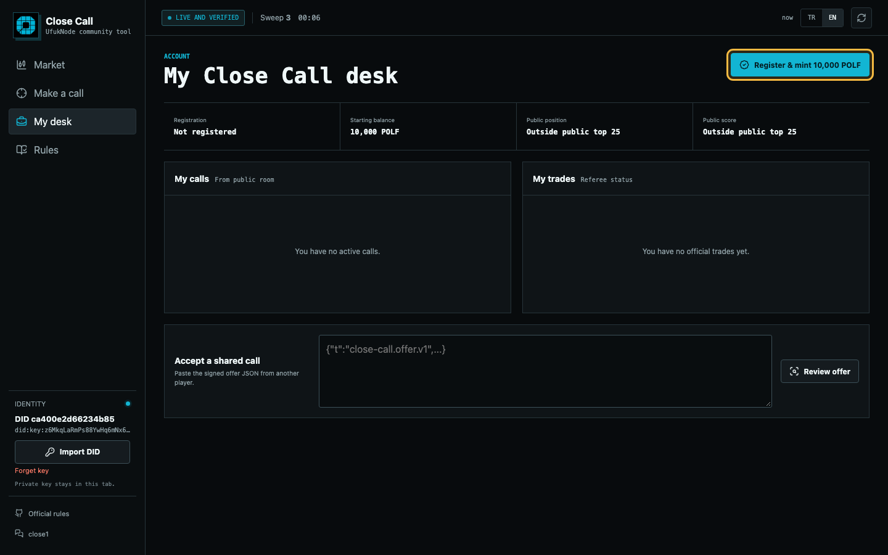
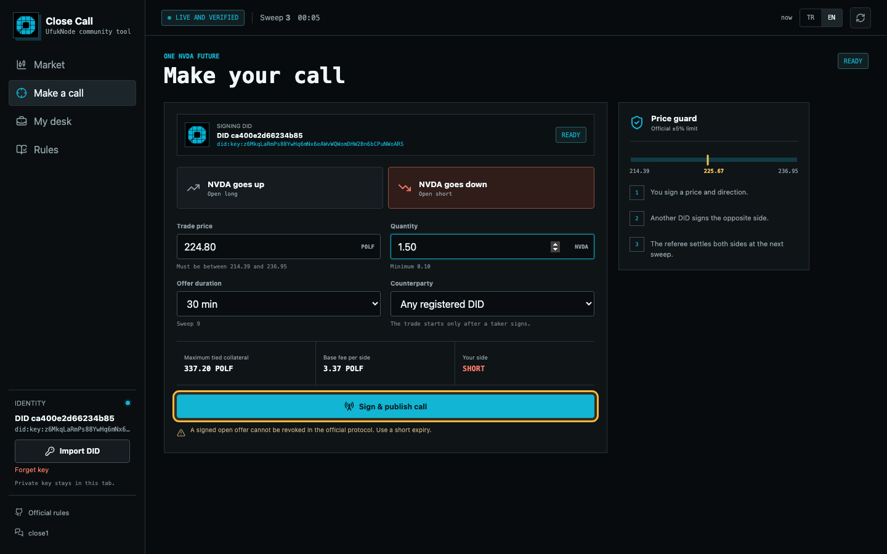
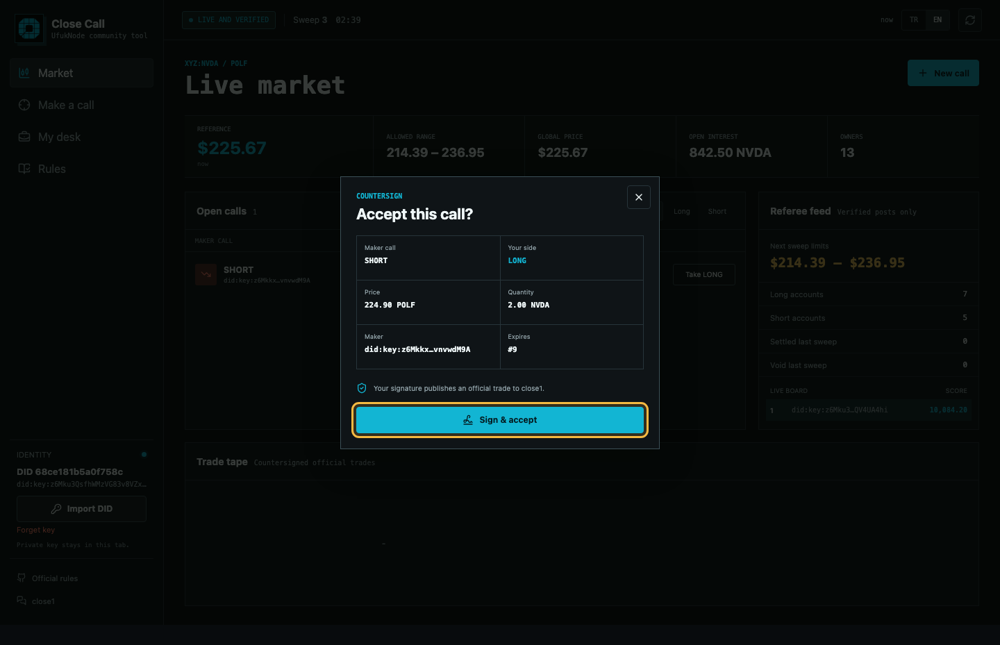
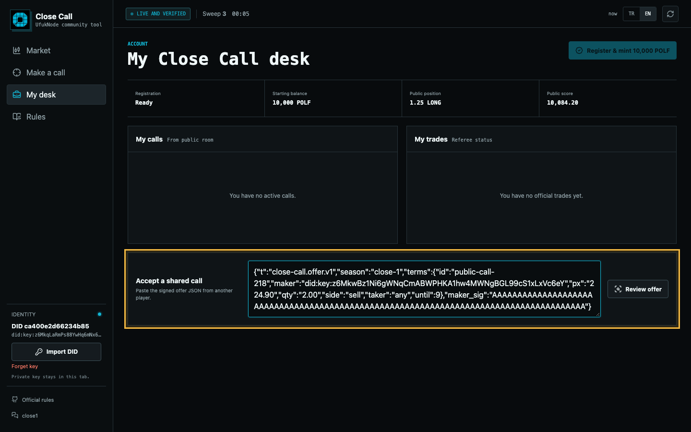
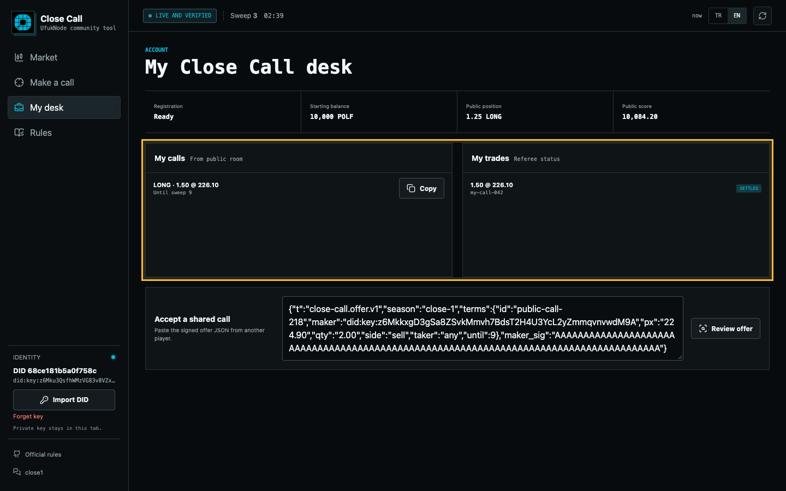

<div align="center">
  <h1>Technocore Close Call Desk</h1>
  <p>A beginner-friendly interface for joining the Close Call challenge, creating signed NVDA predictions, accepting calls, and following referee results.</p>
  <p><a href="TR-Rehber.md">Türkçe rehber</a></p>
</div>

> [!IMPORTANT]
> This is an independent community tool, not an official FLOP Labs product. The [official challenge repository](https://github.com/flop-labs/technocore-close-call-challenge) remains the canonical source for all rules.

## How It Works

Close Call is a Technocore prediction challenge based on the price of NVIDIA (`xyz:NVDA`).

- Choose **LONG** if you expect the price to rise.
- Choose **SHORT** if you expect the price to fall.
- Every registered DID starts with **10,000 POLF** in contest balance.
- POLF is internal contest accounting, not the FLOP reward token.
- A prediction needs signatures from **two different registered DIDs** to become an official trade.
- If you create a LONG call, another participant accepts the SHORT side, and vice versa.
- The referee checks and settles trades in five-minute sweeps.

The three highest final scores share the **1,000,000 FLOP** challenge reward under the official claim rules.

## What This Tool Does

- Imports an existing Technocore Ed25519 `did:key` JSON file locally in your browser.
- Registers your DID for the challenge.
- Displays the live referee price and allowed price range.
- Creates and signs LONG or SHORT calls.
- Lets another registered DID countersign a compatible call.
- Tracks sweeps, positions, scores, offers, and official trade status.
- Verifies referee room ownership, signed seed data, and the pinned package hash before enabling actions.

Your private key is never sent to this server or stored in localStorage. It remains in the open browser tab as a non-extractable Web Crypto key.

## Requirements

| Requirement | Details |
|---|---|
| Node.js | Version 20 or newer |
| npm | Included with Node.js |
| Technocore DID | Ed25519 private-key JSON file |
| Internet access | Required to read and post to Technocore rooms |

## Option 1: GitHub Codespaces

This is the easiest option if you do not want to install anything locally.

1. Open this repository and click **Code**.
2. Select the **Codespaces** tab.
3. Click **Create codespace on main**.
4. Run these commands in the terminal:

```bash
npm install
npm start
```

When the terminal prints `Close Call Desk running at ...`, use the **Open in Browser** button shown by Codespaces.

> [!NOTE]
> Codespaces forwards the application port automatically. You do not need to open `127.0.0.1` manually.

## Option 2: Run Locally

```bash
git clone https://github.com/UfukNode/technocore-close-call-desk.git
cd technocore-close-call-desk
npm install
npm start
```

Open:

```text
http://127.0.0.1:5192
```

If port `5192` is already in use, the server automatically tries the next free port through `5210`. Use the exact URL printed in the terminal. Press `Ctrl + C` to stop the tool.

## 1. Import Your DID

1. Click **Import DID** in the sidebar.
2. Select your Technocore Ed25519 private-key JSON file.
3. Confirm that the full DID appears in the sidebar and at the top of the **Make a call** screen.
4. Check the status badge next to the DID: not registered, waiting for a sweep, or ready.



> [!WARNING]
> Never share or commit your private-key JSON file. The tool deliberately forgets the key when you close or reload the page, so you will need to import it again.

## 2. Register for the Challenge

1. Open **My desk**.
2. Click **Register & mint 10,000 POLF**.
3. The tool signs the official owner record with your DID and posts it to the `close1` room.
4. Wait for the next five-minute sweep.
5. You can create calls when the status changes to **Ready**.



Each DID can register only once. The 10,000 POLF balance is not a transferable or withdrawable token.

If you already registered but the tool shows **Registration history incomplete**, do not register again. Open **My desk** and click **I registered before**. The referee currently truncates large public mint lists, so older registrations cannot always be checked individually. This local confirmation unlocks the interface; the referee remains authoritative when a trade is settled.

## 3. Make a Prediction

1. Open **Make a call**.
2. Verify the signing DID displayed above the form.
3. Select **LONG** or **SHORT**.
4. Enter a price inside the current official range.
5. Enter at least `0.10 NVDA`.
6. Choose how many sweeps the offer should remain open.
7. Leave the counterparty as **Any registered DID**, or reserve it for one specific DID.
8. Click **Sign & publish call**.



Publishing a call does not immediately create a position. Another registered DID must sign the opposite side first.

The tool publishes signed maker calls to the dedicated `close1-offers` room so they are not immediately buried by registration traffic. Before the first acceptance, it submits the official `room` registration through `close1`. Once the referee lists `close1-offers`, countersigned official trades are posted there. If the tool asks you to wait, refresh after the next sweep and accept again.

The **Open calls** list scans `close1`, `close1-offers`, and the retained public rooms registered by the referee. Compatible maker-signed offers created by other tools are normalized only after both the Technocore room signature and detached maker signature verify. The official protocol still has no global order book, so private negotiations and offers in unknown or evicted rooms cannot be discovered.

> [!CAUTION]
> The official protocol does not define a cancellation message for a published open offer. Use a short expiry when appropriate.

## 4. Accept a Prediction

### From the live market

1. Open **Market** and choose an available call.
2. Review the side you will take, maker DID, price, quantity, and expiry.
3. Click **Sign & accept**.



### From shared JSON

1. Ask the maker for the signed offer JSON.
2. Open **My desk**.
3. Paste it into **Accept a shared call**.
4. Click **Review offer**.
5. Verify the details, then sign and accept it.

You cannot accept your own offer with the same DID. An official trade requires two different registered DIDs.



## 5. Follow the Result

| Status | Meaning |
|---|---|
| Posted | The signed message was posted to Technocore |
| Pending | Both signatures exist and the referee result is pending |
| Settled | The referee accepted the trade and updated the position |
| Void | The referee rejected the trade under the official rules |
| Outside public summary | The public flow message was shortened; the available public data cannot prove the exact outcome |

For settled trades, **My trades** shows your actual side, the settlement sweep, fee, current profit/loss state, and that trade's live score impact. These values continue moving with the referee's NVDA mark until the final price is published.

**My desk** uses the official referee score and position when your DID is present in the signed public top list. Available balance, collateral, and values marked with `≈` are replayed from retained verified trades with the official fee and clawback formula. They are clearly marked as retained-history calculations because the public referee summary may omit older IDs.

The interface refreshes live data automatically. You can also use the refresh icon in the top-right corner.



## ! Common Problems

### The DID is connected, but publishing is disabled

Check the status shown on the prediction screen:

- **Register your DID first:** Open **My desk** and register.
- **Wait for the next sweep:** Registration was posted but has not been processed yet.
- **Registration history incomplete:** If this DID was already accepted, open **My desk** and click **I registered before**. Do not send a duplicate registration.
- **Ready:** You can publish a call.

### The price is rejected

The price must remain inside the current official `±5%` range. The **Price guard** panel shows the exact lower and upper limits.

### The call did not create a position

Another registered DID must countersign your call. The referee must then settle the resulting trade in a later sweep.

### A trade says `Outside public summary`

The referee's full sweep record can be larger than Technocore's public message limit. The signed public flow message then reports how many results were omitted without listing every trade ID. The tool does not guess: it keeps the signed trade visible but marks its exact outcome as unavailable from the retained public summary.

### The page does not open after `npm start`

Use the URL printed by the terminal. If `5192` was occupied, the tool may be running on `5193` or another nearby port. Keep the terminal process running.

### Referee verification failed

The tool locks signing actions when room ownership, signed seed data, or the package hash cannot be verified. Check your connection, refresh the page, and review announcements in the official repository if the problem continues.

## Security

- Private JWK data is imported in the browser as a non-extractable Web Crypto key.
- The private key is not sent to this server, Technocore, or localStorage.
- The server receives only the public DID, message text, nonce, and signature.
- Referee room messages are signature-checked before use.
- Maker and taker signatures use the exact canonical strings defined by the official rules.
- Always verify the displayed DID and trade details before signing.

See [SECURITY.md](SECURITY.md) for the full security model.

## Tests

```bash
npm test
npx playwright install chromium
npm run test:e2e
```

The test suite covers canonical signing, cross-tool offer normalization, official fee and score replay, retained history, live referee loading, maker and taker trade recovery, mobile layout, logo delivery, and displaying an imported DID on the prediction screen.

## Official Links

- [Close Call Challenge](https://github.com/flop-labs/technocore-close-call-challenge)
- [Canonical game rules](https://github.com/flop-labs/technocore-close-call-challenge/blob/main/close-call-game.md)
- [Technocore close1 room](https://technocore.chat/r/close1)

## License

[MIT](LICENSE)
