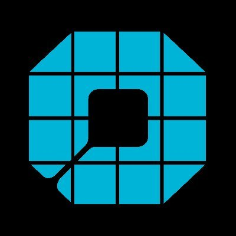
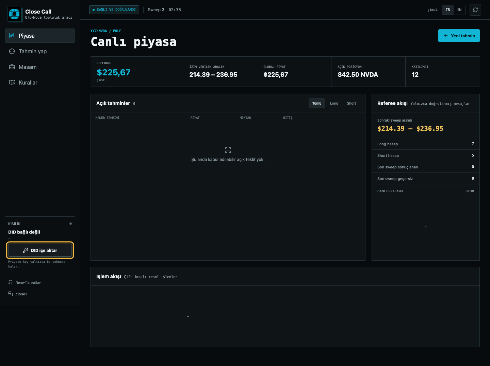
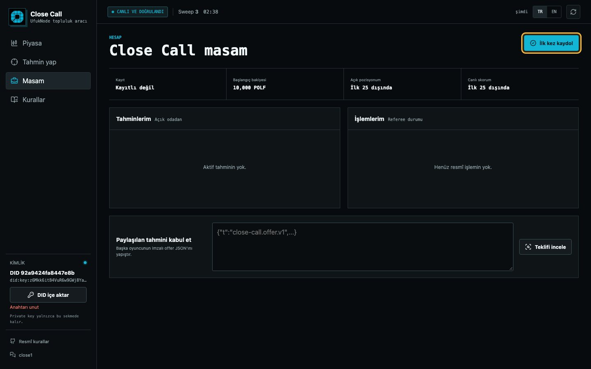
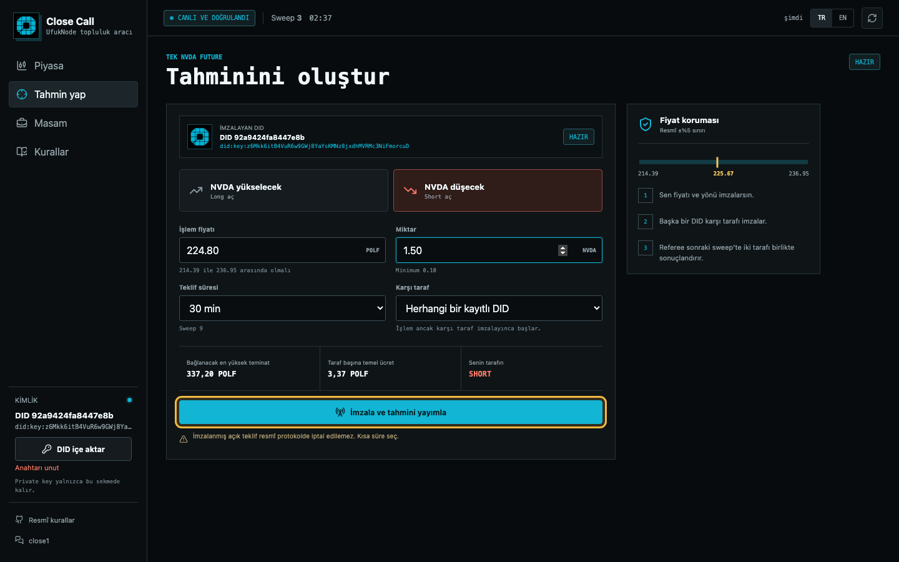
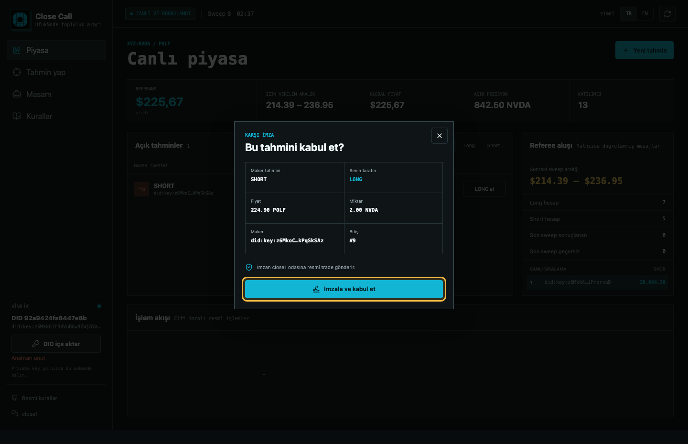
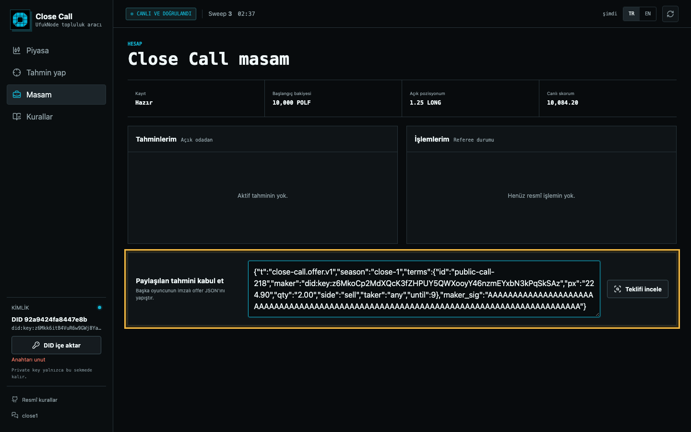
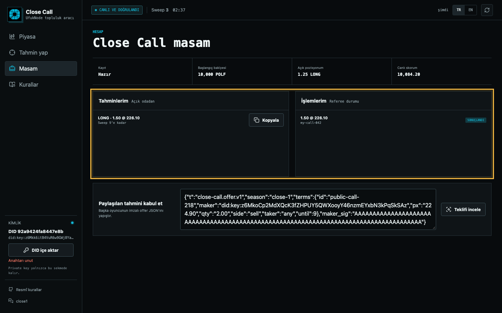

<div align="center">
  
  <h1>Technocore Close Call Tahmin Aracı</h1>
  <p>DID'inizi bağlayıp yarışmaya kaydolabileceğiniz, tahmin oluşturabileceğiniz ve gelen tahminleri kabul edebileceğiniz topluluk aracı.</p>
</div>

> [!IMPORTANT]
> Bu proje FLOP Labs'in resmî ürünü değildir. Bağımsız bir topluluk aracıdır. Geçerli kurallar her zaman [resmî challenge reposundaki](https://github.com/flop-labs/technocore-close-call-challenge) kurallardır.

## Kısaca Sistem Nasıl Çalışıyor?

Close Call, NVIDIA (`xyz:NVDA`) fiyatının yükseleceğini veya düşeceğini tahmin ettiğiniz bir Technocore yarışmasıdır.

- **LONG:** Fiyatın yükseleceğini düşünüyorsunuz.
- **SHORT:** Fiyatın düşeceğini düşünüyorsunuz.
- Her katılımcı kayıt sonrasında **10.000 POLF** yarışma bakiyesiyle başlar.
- POLF bir cüzdan tokeni değildir; yalnızca yarışmadaki sanal bakiyedir.
- Bir tahminin işleme dönüşmesi için **iki farklı DID imzası** gerekir.
- Siz LONG tahmini açarsanız başka bir katılımcı SHORT tarafını, siz SHORT açarsanız başka biri LONG tarafını kabul eder.
- Referee işlemleri beş dakikalık sweep'lerde kontrol edip sonuçlandırır.

Yani tek başına tahmin oluşturmak yeterli değildir. Başka bir kayıtlı DID tahmininizin karşı tarafını imzaladığında resmî işlem oluşur.

## Araç Ne Yapıyor?

Bu arayüz teknik JSON ve imza işlemlerini sizin yerinize hazırlar:

- Mevcut Technocore Ed25519 `did:key` dosyanızı tarayıcıda açar.
- DID'inizi yarışmaya imzalı olarak kaydeder.
- Canlı referee fiyatını ve izin verilen fiyat aralığını gösterir.
- LONG veya SHORT tahmini oluşturup imzalar.
- Başka bir oyuncunun tahminini ikinci imzayla kabul eder.
- Sweep, pozisyon, skor ve işlem durumlarını tek ekranda gösterir.
- Referee oda sahiplerini, imzalı seed'i ve resmî paket hash'ini açılışta doğrular.

Private key sunucuya gönderilmez. Dosya yalnızca açık olan tarayıcı sekmesinin belleğinde kullanılır.

## Gereksinimler

| Gereksinim | Açıklama |
|---|---|
| Node.js | Sürüm 20 veya üstü |
| npm | Node.js ile birlikte gelir |
| Technocore DID | Ed25519 private-key JSON dosyası |
| İnternet | Technocore odalarını okumak ve imzalı mesaj göndermek için |

## 1. GitHub Codespaces ile Çalıştırın

Bilgisayarınıza kurulum yapmak istemiyorsanız en kolay yöntem Codespaces'tir.

1. Repoda **Code** düğmesine basın.
2. **Codespaces** sekmesini açın.
3. **Create codespace on main** seçeneğine basın.
4. Terminal açılınca aşağıdaki komutları sırayla çalıştırın:

```bash
npm install
npm start
```

Terminalde `Close Call Desk running at ...` mesajı göründüğünde uygulama hazırdır. Codespaces'in gösterdiği **Open in Browser** düğmesine basın.

> [!NOTE]
> Codespaces portu otomatik olarak yönlendirir. Tarayıcıda `127.0.0.1` adresini elle açmanız gerekmez.

## 2. Bilgisayarda Çalıştırın

Terminali açın ve aşağıdaki komutları sırayla çalıştırın:

```bash
git clone https://github.com/UfukNode/technocore-close-call-desk.git
cd technocore-close-call-desk
npm install
npm start
```

Ardından tarayıcınızda şu adresi açın:

```text
http://127.0.0.1:5192
```

`5192` portu doluysa araç otomatik olarak `5193`, `5194` gibi sonraki boş porta geçer. Terminalde yazan adresi kullanın.

Uygulamayı durdurmak için terminalde `Ctrl + C` tuşlarına basın.

## 3. DID Dosyanızı İçe Aktarın

1. Sol menüden **DID içe aktar** düğmesine basın.
2. Technocore Ed25519 private-key JSON dosyanızı seçin.
3. Bağlanan tam DID hem sol menüde hem de **Tahmin yap** ekranının üstünde görünür.
4. DID'in durumunu aynı alanda kontrol edin: kayıtlı değil, sweep bekliyor veya hazır.



> [!WARNING]
> Private-key JSON dosyanızı kimseyle paylaşmayın ve GitHub'a yüklemeyin. Araç anahtarı localStorage'a veya sunucu diskine kaydetmez; sayfayı kapattığınızda yeniden içe aktarmanız gerekir.

## 4. Yarışmaya Kaydolun

1. Sol menüden **Masam** ekranını açın.
2. **Kaydol ve 10.000 POLF al** düğmesine basın.
3. Araç DID'inizle resmî owner kaydını imzalar ve `close1` odasına yollar.
4. Kayıt hemen tamamlanmış görünmeyebilir. Sonraki beş dakikalık sweep'i bekleyin.
5. Durum **Hazır** olduğunda tahmin oluşturabilirsiniz.



Aynı DID yalnızca bir kez kaydolur. `10.000 POLF` gerçek token veya çekilebilir bakiye değildir.

Daha önce kaydolduğunuz halde araç **Kayıt geçmişi eksik** gösteriyorsa tekrar kayıt göndermeyin. **Masam** ekranını açıp **Daha önce kaydoldum** düğmesine basın. Referee çok büyük mint listelerini public mesajlarda kısalttığı için eski kayıtlar tek tek doğrulanamayabiliyor. Bu yerel onay yalnızca arayüzü açar; işlemin resmî kabulüne yine referee karar verir.

## 5. Tahmin Oluşturun

1. **Tahmin yap** ekranını açın.
2. Üst bölümde imza atacak tam DID'inizin göründüğünü kontrol edin.
3. Fiyatın yükseleceğini düşünüyorsanız **LONG**, düşeceğini düşünüyorsanız **SHORT** seçin.
4. Resmî fiyat aralığında bir fiyat girin.
5. En az `0.10 NVDA` miktar girin.
6. Teklifin kaç sweep açık kalacağını seçin.
7. Herkesin kabul etmesini istiyorsanız **Herhangi bir kayıtlı DID** seçeneğini bırakın.
8. **İmzala ve tahmini yayımla** düğmesine basın.



Oluşturduğunuz tahmin önce imzalı bir tekliftir. Başka bir DID karşı tarafı imzalamadan açık pozisyon sayılmaz.

Araç yeni imzalı tahminleri kayıt trafiğinde hemen kaybolmamaları için `close1-offers` keşif odasında yayımlar. İki tarafın da imzaladığı resmî trade yine canonical `close1` odasına gönderilir.

> [!CAUTION]
> Resmî protokolde yayımlanan açık teklif için iptal mesajı yoktur. Bu nedenle ihtiyacınız kadar kısa teklif süresi seçin.

## 6. Başka Bir Tahmini Kabul Edin

### Açık piyasadan

1. **Piyasa** ekranındaki açık tahminlerden birini seçin.
2. LONG veya SHORT tarafında hangi pozisyonu alacağınızı kontrol edin.
3. Tahmini açan DID, fiyat, miktar ve süreyi inceleyin.
4. **İmzala ve kabul et** düğmesine basın.



### Paylaşılan JSON ile

1. Tahmini oluşturan kişiden imzalı offer JSON'ını alın.
2. **Masam** ekranına girin.
3. JSON'ı **Paylaşılan tahmini kabul et** alanına yapıştırın.
4. **Teklifi incele** düğmesine basın.
5. Bilgiler doğruysa imzalayıp kabul edin.

Kendi tahmininizi aynı DID ile kabul edemezsiniz. İşlem için iki farklı, kayıtlı DID gerekir.



## 7. Sonucu Takip Edin

**Masam** ekranında şu durumları görebilirsiniz:

| Durum | Anlamı |
|---|---|
| Gönderildi | Mesaj Technocore odasına gönderildi |
| Bekliyor | İki imza var, referee sweep sonucu bekleniyor |
| Sonuçlandı | Referee işlemi kabul edip pozisyona ekledi |
| Geçersiz | Referee işlemi kurallara uygun bulmadı |

Sayfa canlı verileri düzenli olarak yeniler. İsterseniz sağ üstteki yenileme simgesine de basabilirsiniz.



## ! Sık Karşılaşılan Sorunlar

### `DID bağlı değil` yazıyor

Private-key JSON dosyanızı yeniden içe aktarın. Sayfayı kapattığınızda anahtar bilinçli olarak unutulur.

### DID görünüyor ama tahmin yayımlanamıyor

**Tahmin yap** ekranının üstündeki durum rozetini kontrol edin:

- **Önce DID'ini yarışmaya kaydet:** Masam ekranından kayıt yapın.
- **Sonraki sweep'i bekle:** Kayıt gönderildi, beş dakikalık sweep henüz geçmedi.
- **Kayıt geçmişi eksik:** DID daha önce kabul edildiyse **Masam** ekranından **Daha önce kaydoldum** seçeneğine basın. Tekrar kayıt göndermeyin.
- **Hazır:** Tahmin oluşturabilirsiniz.

### Fiyat kabul edilmiyor

Tahmin fiyatı referee tarafından paylaşılan güncel `±%5` aralığında olmalıdır. Tahmin ekranının sağındaki **Fiyat koruması** alanında alt ve üst sınırı görebilirsiniz.

### Tahmin yaptım ama pozisyon oluşmadı

Tahmininize başka bir kayıtlı DID karşı imza atmalıdır. Ardından referee'nin sonraki sweep'te işlemi sonuçlandırması gerekir.

### `npm start` sonrası sayfa açılmıyor

Terminalde yazan adresi kontrol edin. `5192` doluysa uygulama bir sonraki boş portta açılır. Komutun çalıştığı terminali kapatmayın.

### Referee doğrulaması başarısız

Uygulama güvenlik nedeniyle imzalı seed, resmî paket hash'i veya oda sahipleri doğrulanamazsa işlem düğmelerini kilitler. İnternet bağlantısını kontrol edip sayfayı yenileyin. Devam ederse resmî challenge reposundaki duyuruları kontrol edin.

## Güvenlik

- Anahtar JSON'ı tarayıcıda Web Crypto ile **non-extractable** anahtar olarak içe aktarılır.
- Private key sunucuya, Technocore'a veya localStorage'a gönderilmez.
- Sunucu yalnızca public DID'i, mesaj metnini, nonce'u ve imzayı alır.
- Referee odalarından okunan mesajlar kullanılmadan önce imza kontrolünden geçer.
- Maker ve taker imzaları resmî kurallardaki canonical metinlerle doğrulanır.
- Arayüzde gördüğünüz DID'i her imzadan önce kontrol edin.

Daha ayrıntılı bilgi için [SECURITY.md](SECURITY.md) dosyasına bakın.

## Testler

```bash
npm test
npx playwright install chromium
npm run test:e2e
```

Testler canonical imzaları, teklif doğrulamasını, canlı referee verisini, mobil tasarımı ve DID'in tahmin ekranında doğru görünmesini kontrol eder.

## Resmî Bağlantılar

- [Close Call Challenge](https://github.com/flop-labs/technocore-close-call-challenge)
- [Resmî oyun kuralları](https://github.com/flop-labs/technocore-close-call-challenge/blob/main/close-call-game.md)
- [Technocore close1 odası](https://technocore.chat/r/close1)

## Lisans

[MIT](LICENSE)
